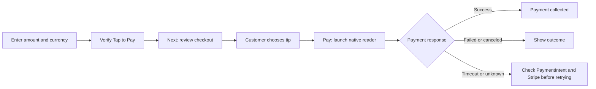

<div align="center">

# 📱 Tap to Pay Collector

### From Work Order to checkout — right on the technician’s phone.

**Enter an amount → Verify Tap to Pay → Choose a tip → Review the total → Tap**

[](https://github.com/cchidume-coder/tap-to-pay-lwc/actions/workflows/validate.yml)

[Start here](#-choose-your-path) · [Install](#-get-it-running) · [Invoice extension](#-build-the-optional-invoice-extension) · [AI-agent handoff](#-hand-this-repo-to-your-ai-agent)

</div>

A rounded, SLDS-inspired Lightning Web Component for **Salesforce Field Service mobile**, built around native Salesforce Payments. Bring your own merchant configuration; this repo provides the checkout UI and payment-service integration.

> **What you can replicate:** the standalone payment collector, including tipping, configurable flat tax, reader launch, and response handling. Merchant onboarding, device eligibility, permissions, and mobile action placement are setup steps in your own org.

## 🧭 Choose your path

| | Standalone checkout — included | Invoice-connected checkout — optional build |
| --- | --- | --- |
| Amount source | Technician enters the pre-tax amount | Your integration reads the invoice’s outstanding balance |
| Invoice dependencies | None | Your invoice schema and an adapter/controller |
| Paid-invoice protection | No invoice lookup | Add a paid-state check before allowing collection |
| Payment launch | Native `collectPayment()` | Reuse the payment pattern after resolving the amount |
| Invoice updates | No invoice updates | Build confirmed-payment reconciliation |
| Where to start | Configure and deploy this repo | Deploy the core, then implement your invoice mapping |

**The optional invoice extension is a blueprint, not an included package.** The original implementation used an invoice-connected `fieldServiceTapToPay` component. This asset uses **`tapToPayCollector`** and **`WorkOrder.Collect_Tap_to_Pay`** so it can coexist with that original build. No invoice Apex or invoice objects are shipped here.

## ✨ Follow the checkout



- **Customer choice:** 15%, 18% initially selected, 20%, no tip, or a custom monetary tip.
- **Clear totals:** subtotal, tax, tip, and the final Pay amount.
- **Pre-tax tipping:** tips use the subtotal before tax.
- **Configurable tax:** a flat **8.25%** default. It is application configuration, not a connection to Salesforce TaxPolicy or Stripe Tax.
- **Bounded waiting:** 30 seconds for availability; 90 seconds for the payment response.

### A checkout you can check by hand

| Subtotal | Tax at 8.25% | Tip at 18% of subtotal | Pay total |
| --- | --- | --- | --- |
| $7.75 | $0.64 | $1.40 | **$9.79** |

The collector sends **one combined amount** to `collectPayment()`. It does not create separate tax, tip, or invoice accounting entries.

## 🚀 Get it running

### 1. Bring the org and device

You’ll need Salesforce CLI, an authenticated org with Work Orders and native Salesforce Payments, and the appropriate Field Service/mobile payment permissions and licenses. Payment collection runs on a supported physical device in the **Salesforce Field Service app**. A browser displays an unavailable message.

**Start with Payments setup:** follow the [merchant checklist below](#-merchant-setup-do-this-before-your-first-tap), then configure the component.

### 2. Clone and configure

```bash
git clone https://github.com/cchidume-coder/tap-to-pay-lwc.git
cd tap-to-pay-lwc
```

The repository is public and can be cloned without collaborator access.

Edit [`tapToPayConfig.js`](force-app/main/default/lwc/tapToPayConfig/tapToPayConfig.js):

```js
merchantAccountId: '',           // Your Salesforce MerchantAccount ID
merchantName: 'Salesforce Payments',
countryIsoCode: 'US',
currencyIsoCode: 'USD',
taxRatePercent: 8.25,
```

**The Merchant Account ID is intentionally blank.** Payment actions remain disabled until it is configured. Timeout values are configurable in the same file. Configuration lives in a module because `lightning__RecordAction` does not support App Builder component properties.

Amounts use two decimal places. The currency picker is not a statement that your merchant supports every listed currency; confirm country, currency, and device compatibility.

### 3. Deploy the standalone asset

```bash
sf org login web --alias recipient-org
sf project deploy start --target-org recipient-org --source-dir force-app
```

Deployable files:

```text
force-app/main/default/
├── lwc/
│   ├── tapToPayCollector/        # Checkout JS, HTML, CSS, metadata
│   └── tapToPayConfig/           # Recipient merchant and tax configuration
└── quickActions/
    └── WorkOrder.Collect_Tap_to_Pay.quickAction-meta.xml
```

No Apex class, invoice object, or invoice permission set is required for the standalone build.

### 4. Put it on the Work Order

Add **Collect Tap to Pay** to the Work Order action configuration used by your Field Service mobile app. The component also exposes a Work Order record-page target. Verify the action placement on your actual Field Service app/version; the general Salesforce mobile app and mobile web are different surfaces.

Give the mobile user read access to `WorkOrder.AccountId` and `WorkOrder.WorkOrderNumber`. Associate the Work Order with the customer Account before collecting. The public `collectPayment` reference marks `payerAccountId` required, while the type definitions mark it optional; this asset requires the Work Order Account to avoid depending on that discrepancy.

### 5. Run an on-device acceptance test

Open a Work Order → enter the amount → **Verify Tap to Pay** → **Next** → choose a tip → **Pay**.

Check the displayed total, the reader result, and the matching `PaymentIntent`/Stripe outcome. Automated checks validate code behavior; a successful physical-device test in the recipient org is still required.

## 🏗️ Build the optional invoice extension

Want the technician to collect an invoice balance instead of typing an amount? Use the same checkout pattern, with a recipient-specific invoice integration around it.

> **Reading the balance and updating the invoice are two separate jobs.** A controller that returns an invoice balance does not automatically mark the invoice paid when a payment succeeds.

### Map your invoice model

| Integration decision | What your build needs |
| --- | --- |
| Work Order → invoice | Define the relationship and which invoice to select if several exist |
| Amount to collect | Read the outstanding balance, its currency, and whether it already includes tax |
| Paid state | Prevent collection when the selected invoice is settled; define partial-payment behavior |
| Permissions | Enforce record sharing, object access, and field access in the adapter/controller |
| Payment attribution | Keep a reliable link between the invoice and the payment attempt |
| Reconciliation | Apply confirmed payments to the invoice exactly once; handle delayed outcomes and retries |
| Tip accounting | Decide where tips are recorded and whether they affect the invoice balance |

The original implementation used `TapToPayInvoiceController` and an org-specific `SDO_Sales_Invoice_Example__c` schema. **Those dependencies are intentionally excluded.** Map your actual invoice system rather than assuming that demo schema exists in every org. The core is not a drop-in invoice plug-in API; the recipient must implement the adapter and the necessary component changes.

### Keep the amount correct

- **Avoid double taxation.** If the outstanding balance already includes tax, do not add another 8.25%. Decide whether tax is already final or needs calculation before displaying checkout.
- **Keep tips separate from debt settlement.** A tip added to the charge does not necessarily reduce the invoice’s outstanding balance.
- **Confirm before updating.** Define which authoritative payment status permits balance reduction and a paid-state update.
- **Reconcile once.** A delayed success or repeated notification must not apply the same payment twice.
- **Handle uncertainty.** Declines, cancellations, and timeouts must not be treated as paid. A timeout is also not proof of failure.

Keep the extension separate from the standalone core so adopters who only need manual collection can install the small bundle.

## 🤖 Hand this repo to your AI agent

Copy this prompt after giving the agent access to the repository:

```text
Use this repository to implement the standalone Tap to Pay collector in my
Salesforce org. Read README.md and tapToPayConfig.js first.

Inspect the target org's Payments setup, Work Order access, and Field Service
mobile action configuration. Ask for missing merchant/environment details.
Configure my Merchant Account ID, country, currency, merchant name, and tax rate.
Keep isAvailable → getSupportedPaymentMethods → collectPayment gating intact.
Run the provided tests and LWC compiler validation, then deploy to the target
org I authorize and guide me through an on-device acceptance test.

Start with the standalone manual-amount version. Do not add invoice objects
or Apex unless I explicitly request the optional invoice extension.
If I request invoices, inspect my actual invoice schema and propose mappings,
paid-state checks, tax treatment, tip accounting, and idempotent payment
reconciliation before implementing it. Do not assume the original demo
invoice schema exists. Do not overwrite an existing invoice-connected build.

Treat a payment timeout as an unknown outcome. Check PaymentIntent and Stripe
before retrying. Never infer payment failure from empty Apex logs alone.
```

The repo supplies source, configuration points, tests, and setup guidance. Your agent still needs access to your org and your authorization for deployment; it cannot infer merchant configuration or provision payment services from a clone alone.

## 📍 Merchant setup: do this before your first tap

> **Lesson from the original build:** correct the address in **Setup → Company Information before creating the Merchant Account**. In that org, creating an account after correcting the address resulted in its PaymentGateway receiving a provisioned Tap-to-Pay location. This is an observed setup lesson, not proof that every existing account must be recreated.

- [ ] Complete/correct the Company Information address before merchant creation.
- [ ] Complete native Payments onboarding in the intended **Test or Live** environment.
- [ ] Inspect the gateway’s `MerchantAccountId`, `PaymentStatus`, `GatewayMode`, and `DefaultTapToPayLocation`.
- [ ] Verify the Tap-to-Pay location on **PaymentGateway**. It can be present there while null on MerchantAccount.
- [ ] Match the merchant and Terminal location environments.
- [ ] Verify device/OS support, location permission, connectivity, and Field Service access.
- [ ] Run the three-step API flow and verify the actual payment result.

The original native gateways used **Status=Complete / PaymentStatus=Enabled**. Do not force an Apex-adapter status or provider linkage just to match another integration model. Direct location-field updates were rejected in the original org; use supported Payments setup/support procedures rather than assuming a generic sync button exists.

For Test mode, use the supported **Stripe Terminal test/simulation procedure** for your device integration. A typed web test PAN is not automatically a physical NFC test card.

## 🔎 Find out what happened to a payment

**Look at `PaymentIntent`, not only Apex logs.** Native attempts can produce PaymentIntent records while ApexLog, PaymentGatewayLog, PaymentAuthorization, and Payment remain empty. Missing Apex logs do not prove the request never reached Salesforce.

```sql
SELECT PaymentIntentNumber, Status, IntentAmount, EntryMode,
       MerchantAccountId, PaymentGatewayId, ProviderReference, CreatedDate
FROM PaymentIntent
WHERE CreatedDate = TODAY
ORDER BY CreatedDate DESC
```

| What you see | What to do next |
| --- | --- |
| Reader returns `success` | The component shows the collected state; confirm the matching payment record |
| Failed intent | Inspect the returned error and Stripe details for the actual cause |
| Created/pending intent | Investigate the matching Stripe intent before retrying |
| Spinner timeout or unknown result | Reconcile in Salesforce Payments and Stripe; the native request may still be processing |
| No Apex log | Check PaymentIntent and Stripe; do not conclude the payment failed |

The UI shows completion only for `status: 'success'` (case-insensitive). Unexpected/empty statuses require reconciliation. A timeout releases the spinner and blocks Pay; a late native response can still update the outcome. Use **“I verified this attempt is unpaid”** only after checking the attempt. That button does not cancel a native payment.

## 🧪 Check the asset before deployment

Requires Node.js 20 or newer:

```bash
npm ci
npm test
npm run validate
```

The controller tests use platform stubs to exercise calculations, availability gating, the payment payload, duplicate-click prevention, synchronous errors, timeouts, late responses, and disconnect cleanup. Asset checks verify separation from the original invoice dependencies. Compiler validation checks the actual LWC JavaScript, HTML, and CSS. GitHub Actions runs these checks on pushes and pull requests.

**Validation boundary:** these checks do not simulate a physical reader, validate recipient org provisioning, or replace the on-device acceptance test. They do not modify a Salesforce org.

## 📚 Reference shelf

- [PaymentsService workflow](https://developer.salesforce.com/docs/platform/mobile-offline/guide/use-paymentsservice-in-a-lightning-component.html)
- [collectPayment options](https://developer.salesforce.com/docs/platform/lwc/guide/reference-lightning-paymentsservice-collectpayment.html)
- [Record action configuration](https://developer.salesforce.com/docs/platform/lwc/guide/targets-lightning-record-action.html)
- [Stripe Terminal testing](https://docs.stripe.com/terminal/references/testing)

## 📄 Licensing

This repository is public. License selection is pending; public visibility does not itself grant an open-source license or general reuse permission. Compare the options in [LICENSE-OPTIONS.md](LICENSE-OPTIONS.md).
